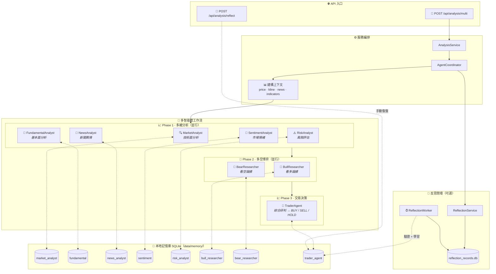

<div align="center">
  <a href="README.md">🇺🇸 English</a> |
  <a href="README_CN.md">🇨🇳 简体中文</a> |
  <a href="README_TW.md">🇹🇼 繁體中文</a> |
  <a href="README_JA.md">🇯🇵 日本語</a> |
  <a href="README_KO.md">🇰🇷 한국어</a>
</div>
<br/>

<div align="center">
  <a href="https://github.com/brokermr810/QuantDinger">
    
  </a>

  <h1 align="center">QuantDinger</h1>

  <h3 align="center">
    下一代 AI 量化交易平台
  </h3>

  <p align="center">
    <strong>🤖 AI 原生 · 🐍 可視化 Python · 🌍 全球多市場 · 🔒 隱私優先</strong>
  </p>
  <p align="center">
    <i>擁有 AI 副駕駛的構建、回測與交易平台。比 PineScript 更強，比 SaaS 更智能。</i>
  </p>

  <p align="center">
  <a href="https://www.quantdinger.com"><strong>官方社區</strong></a> ·
  <a href="https://ai.quantdinger.com"><strong>在線演示</strong></a> ·
  <a href="https://youtu.be/HPTVpqL7knM"><strong>📺 視頻演示</strong></a> ·
  <a href="CONTRIBUTORS.md"><strong>🌟 加入我們</strong></a>
  </p>

  <p align="center">
    <a href="LICENSE"></a>
    
    
    
    
  </p>

  <p align="center">
    <a href="https://t.me/quantdinger"></a>
    <a href="https://discord.gg/vwJ8zxFh9Q"></a>
    <a href="https://x.com/HenryCryption"></a>
  </p>
</div>

---

## 📖 簡介

### QuantDinger 是什麼？

QuantDinger 是一個**本地優先、隱私優先、自託管的量化交易基礎設施**。它運行在你的機器/伺服器上，提供 **PostgreSQL 支持的多用戶帳號體系**，同時讓你完全控制自己的策略、交易數據和 API 密鑰。

### 為什麼選擇本地優先？

與將你的數據和策略鎖定在雲端的 SaaS 平台不同，QuantDinger 在本地運行。你的策略、交易日誌、API 密鑰和分析結果都保留在你的機器上。沒有供應商鎖定，沒有訂閱費用，沒有數據洩露風險。

### 適合誰使用？

QuantDinger 為以下用戶而構建：
- 重視數據主權和隱私的交易員、研究員和工程師
- 需要透明、可審計的交易基礎設施
- 更偏好工程而非營銷
- 需要完整的工作流：數據、分析、回測和執行

### 核心功能

QuantDinger 包含一個內置的**基於 LLM 的多智能體研究系統**，能夠從網絡收集金融情報，結合本地市場數據，生成分析報告。這與策略開發、回測和實盤交易工作流無縫集成。

### 核心價值

- **🔓 Apache 2.0 開源（代碼）**：寬鬆且商業友好。你可以在 Apache 2.0 下 fork/修改代碼，但需保留許可與署名等必要聲明。
- **🐍 Python 原生 & 可視化**：使用標準 Python 編寫指標（比 PineScript 更簡單），並由 AI 輔助。直接在圖表上可視化信號——打造「本地版 TradingView」體驗。
- **🤖 AI 閉環優化**：不僅運行策略，AI 還會分析回測結果並建議參數調整（止損/止盈/MACD 設置），形成閉環優化。
- **🌍 全球市場接入**：統一系統支持加密貨幣（實盤）、美股/A股、外匯和期貨（數據/通知）。
- **⚡ Docker & 清晰架構**：4 行命令極速部署。現代技術棧（Vue + Python），架構清晰，關注點分離。

---

## 📺 視頻演示

<div align="center">
  <a href="https://youtu.be/HPTVpqL7knM">
    
  </a>
  <p><strong>點擊上方視頻觀看 QuantDinger 專案介紹</strong></p>
</div>

---

## 📚 文檔

### 開發指南
- [Python 策略開發指南](docs/STRATEGY_DEV_GUIDE_TW.md)
- [盈透證券 (IBKR) 實盤交易指南](docs/IBKR_TRADING_GUIDE_CN.md) 🆕
- [MetaTrader 5 (MT5) 外匯實盤交易指南](docs/MT5_TRADING_GUIDE_CN.md) 🆕

### 通知配置
- [Telegram 通知配置](docs/NOTIFICATION_TELEGRAM_CONFIG_CH.md)
- [郵件 (SMTP) 通知配置](docs/NOTIFICATION_EMAIL_CONFIG_CH.md)
- [簡訊 (Twilio) 通知配置](docs/NOTIFICATION_SMS_CONFIG_CH.md)

## 📸 功能預覽

<div align="center">
  <h3>🗺️ 系統架構總覽</h3>
  <p>QuantDinger AI 驅動的研究、回測和自動化交易功能全景圖。</p>
  
</div>

<br/>

<div align="center">
  <h3>📊 專業量化儀表盤</h3>
  <p>實時監控市場動態、資產狀況和策略狀態。</p>
  
</div>

<br/>

<table align="center" width="100%">
  <tr>
    <td width="50%" align="center" valign="top">
      <h3>🤖 AI 深度投研</h3>
      <p>多智能體協作進行市場情緒與技術分析。</p>
      
    </td>
    <td width="50%" align="center" valign="top">
      <h3>💬 智能交易助手</h3>
      <p>通過自然語言接口獲取即時市場洞察。</p>
      
    </td>
  </tr>
  <tr>
    <td width="50%" align="center" valign="top">
      <h3>📈 交互式指標分析</h3>
      <p>豐富的技術指標庫，支持拖拽式分析。</p>
      
    </td>
    <td width="50%" align="center" valign="top">
      <h3>🐍 Python 策略生成</h3>
      <p>內置編輯器，支持 AI 輔助策略代碼編寫。</p>
      
    </td>
  </tr>
  <tr>
    <td colspan="2" align="center" valign="top">
      <h3>📊 資產監測</h3>
      <p>追蹤持倉、設置預警，並通過郵件/Telegram 接收 AI 分析報告。</p>
      
    </td>
  </tr>
</table>

---

## ✨ 關鍵特性

### 1. 可視化 Python 策略工作台
*比 PineScript 更強，比 SaaS 更智能。*

- **Python 原生**：用 Python 編寫指標和策略。利用完整的 Python 生態（Pandas, Numpy, TA-Lib），而不是 PineScript 這種專用語言。
- **"Mini-TradingView" 體驗**：直接在內置的 K 線圖上運行你的 Python 指標。在歷史數據上可視化調試買賣信號。
- **AI 輔助編程**：讓內置 AI 為你編寫複雜的邏輯。從創意到代碼只需幾秒鐘。

### 2. 完整的交易生命週期
*從指標到執行，無縫銜接。*

1.  **指標**：定義你的市場入場/出場信號。
2.  **策略配置**：附加風險管理規則（倉位管理、止損、止盈）。
3.  **回測 & AI 優化**：運行回測，查看豐富的性能指標，並**讓 AI 分析結果以建議改進**（例如：「調整 MACD 閾值為 X」）。
4.  **執行模式**：
    - **實盤交易**：
      - **加密貨幣**：直接 API 執行，支持 10+ 交易所（Binance, OKX, Bitget, Bybit 等）
      - **美股/港股**：通過盈透證券 (IBKR) 🆕
      - **外匯**：通過 MetaTrader 5 (MT5) 🆕
    - **信號通知**：針對不支持實盤交易的市場（A股/期貨），通過 Telegram, Discord, Email, SMS 或 Webhook 發送信號。

### 3. AI 多智能體投研
*你的 7x24 小時 AI 投委會。*

系統僱用了一個多智能體團隊作為你策略的二次過濾器：

- **研究智能體**：抓取網絡新聞和宏觀事件（Google/Bing）。
- **分析智能體**：分析技術指標和資金流向。
- **策略集成**：AI 的判斷可以作為「市場過濾器」——僅當 AI 情緒一致時才允許策略交易（例如：「如果 AI 風險分析師標記宏觀風險極高，則不要買入」）。

### 4. 通用數據引擎

QuantDinger 提供跨多個市場的統一數據接口：

- **加密貨幣**：直接 API 連接進行交易（10+ 交易所）和 CCXT 集成獲取行情數據（100+ 數據源）
- **股票**：Yahoo Finance、Finnhub、Tiingo（美股）和 AkShare（A股/港股）
- **期貨/外匯**：OANDA 和主要期貨數據源
- **代理支持**：內置代理配置，適應受限網絡環境

### 5. 🧠 AI 記憶增強系統（Memory-Augmented Agents）
QuantDinger 的多智能體不是「每次從零開始」。後端內建**本地記憶庫 + 反思閉環**：在生成提示詞（prompt）時檢索過往經驗並注入到 system prompt，並可在事後驗證/復盤後把結果寫回記憶庫。

- **本質**：RAG 風格「經驗檢索增強」，**不是**訓練/微調模型權重（零外部向量庫依賴）。
- **隱私**：所有記憶與反思記錄預設落盤在本地 SQLite：`backend_api_python/data/memory/`。

#### 邏輯圖（從請求到記憶閉環）



#### 檢索排序（簡化）
\[
score = w_{sim}\cdot sim + w_{recency}\cdot recency + w_{returns}\cdot returns\_score
\]

#### 兩條「學習」通道
- **手動復盤（推薦）**：`POST /api/analysis/reflect` 寫入真實交易結果（returns/result）
- **自動反思（可選）**：`ENABLE_REFLECTION_WORKER=true` 後，背景任務按 `REFLECTION_WORKER_INTERVAL_SEC` 驗證到期記錄並寫回記憶

#### 关键環境變量（`.env`）
- `ENABLE_AGENT_MEMORY`, `AGENT_MEMORY_TOP_K`, `AGENT_MEMORY_CANDIDATE_LIMIT`
- `AGENT_MEMORY_ENABLE_VECTOR`, `AGENT_MEMORY_EMBEDDING_DIM`
- `AGENT_MEMORY_HALF_LIFE_DAYS`, `AGENT_MEMORY_W_SIM`, `AGENT_MEMORY_W_RECENCY`, `AGENT_MEMORY_W_RETURNS`
- `ENABLE_REFLECTION_WORKER`, `REFLECTION_WORKER_INTERVAL_SEC`

### 6. 策略運行時

- **基於線程的執行器**：獨立的線程池用於策略執行
- **自動恢復**：系統重啟後恢復運行中的策略
- **訂單隊列**：後台工作線程用於訂單執行

### 7. 多LLM提供商支援

QuantDinger 支援多個 AI 提供商，具備自動檢測功能：

| 提供商 | 特點 |
|--------|------|
| **OpenRouter** | 多模型閘道（預設），100+ 模型 |
| **OpenAI** | GPT-4o, GPT-4o-mini |
| **Google Gemini** | Gemini 1.5 Flash/Pro |
| **DeepSeek** | DeepSeek Chat（高性價比） |
| **xAI Grok** | Grok Beta |

只需在 `.env` 中配置您首選提供商的 API 金鑰，系統會自動檢測可用提供商。

### 8. 使用者管理與安全

- **多使用者支援**：基於 PostgreSQL 的使用者帳戶，支援基於角色的權限管理
- **OAuth 登入**：Google 和 GitHub OAuth 整合
- **郵箱驗證**：透過郵箱驗證碼進行註冊和密碼重設
- **安全功能**：Cloudflare Turnstile 人機驗證、IP/帳戶速率限制
- **示範模式**：用於公開示範的唯讀模式

### 9. 技術棧

- **後端**：Python (Flask) + PostgreSQL + Redis（可選）
- **前端**：Vue 2 + Ant Design Vue + KlineCharts/ECharts
- **部署**：Docker Compose

---

## 🔌 支持的交易所和券商

QuantDinger 支持多種市場類型的執行方式：

### 加密貨幣交易所（直接 API）

| 交易所 | 市場 |
|:--------:|:---------|
| Binance | 現貨, 合約, 槓桿 |
| OKX | 現貨, 永續, 期權 |
| Bitget | 現貨, 合約, 跟單交易 |
| Bybit | 現貨, 線性合約 |
| Coinbase Exchange | 現貨 |
| Kraken | 現貨, 合約 |
| KuCoin | 現貨, 合約 |
| Gate.io | 現貨, 合約 |
| Bitfinex | 現貨, 衍生品 |
| Deepcoin | 現貨, 永續 |

### 傳統券商

| 券商 | 市場 | 平台 |
|:------:|:--------|:---------|
| **盈透證券 (IBKR)** | 美股, 港股 | TWS / IB Gateway 🆕 |
| **MetaTrader 5 (MT5)** | 外匯 | MT5 終端 🆕 |

### 行情數據（通過 CCXT）

Bybit、Gate.io、Kraken、KuCoin、HTX 以及 100+ 其他交易所用於行情數據。


---

### 多語言支持

QuantDinger 為全球用戶構建，提供全面的國際化支持：

<p>
  
  
  
  
  
  
  
  
  
  
</p>

所有 UI 元素、錯誤信息和文檔均已完全翻譯。語言會根據瀏覽器設置自動檢測，也可以在應用中手動切換。

---

### 支持的市場

| 市場類型 | 數據源 | 交易 |
|-------------|--------------|---------|
| **加密貨幣** | Binance, OKX, Bitget, + 100 交易所 | ✅ 全面支持 |
| **美股** | Yahoo Finance, Finnhub, Tiingo | ✅ 通過盈透證券 🆕 |
| **港股** | AkShare, 東方財富 | ✅ 通過盈透證券 🆕 |
| **A股** | AkShare, 東方財富 | ⚡ 僅數據 |
| **外匯** | Finnhub, OANDA | ✅ 通過 MT5 🆕 |
| **期貨** | 交易所 API, AkShare | ⚡ 僅數據 |

---

### 架構 (當前倉庫)

```text
┌─────────────────────────────┐
│      quantdinger_vue         │
│   (Vue 2 + Ant Design Vue)   │
└──────────────┬──────────────┘
               │  HTTP (/api/*)
               ▼
┌─────────────────────────────┐
│     backend_api_python       │
│   (Flask + 策略運行時)       │
└──────────────┬──────────────┘
               │
               ├─ SQLite (quantdinger.db)
               ├─ Redis (可選緩存)
               └─ 數據提供商 / LLMs / 交易所
```

---

### 倉庫目錄結構

```text
.
├─ backend_api_python/         # Flask API + AI + 回測 + 策略運行時
│  ├─ app/
│  ├─ env.example              # 複製為 .env 進行本地配置
│  ├─ requirements.txt
│  └─ run.py                   # 入口點
└─ quantdinger_vue/            # Vue 2 UI (開發服務器代理 /api -> 後端)
```

---

## 快速開始

### 選項 1: Docker 部署 (推薦)

運行 QuantDinger 最快的方式。

#### 1. 一鍵啟動

**Linux / macOS**
```bash
git clone https://github.com/brokermr810/QuantDinger.git && \
cd QuantDinger && \
cp backend_api_python/env.example backend_api_python/.env && \
docker-compose up -d --build
```

**Windows (PowerShell)**
```powershell
git clone https://github.com/brokermr810/QuantDinger.git
cd QuantDinger
Copy-Item backend_api_python\env.example -Destination backend_api_python\.env
docker-compose up -d --build
```

#### 2. 訪問與配置

- **前端 UI**: http://localhost:8888
- **默認賬號**: `quantdinger` / `123456`

> **注意**：為了使用 AI 功能或生產環境安全，請編輯 `backend_api_python/.env`（添加 `OPENROUTER_API_KEY`，修改密碼），然後執行 `docker-compose restart backend` 重啟服務。

#### 3. 訪問應用

- **前端 UI**: http://localhost
- **後端 API**: http://localhost:5000

#### Docker 命令參考

```bash
# 查看運行狀態
docker-compose ps

# 查看日誌
docker-compose logs -f

# 停止服務
docker-compose down

# 停止並刪除卷 (警告：會刪除數據庫！)
docker-compose down -v
```

#### 數據持久化

以下數據掛載到主機，重啟容器後依然保留：

```yaml
volumes:
  - ./backend_api_python/logs:/app/logs                       # 日誌
  - ./backend_api_python/data:/app/data                       # 數據目錄（包含 quantdinger.db）
  - ./backend_api_python/.env:/app/.env                       # 配置文件
```

---

### 選項 2: 本地開發

**先決條件**
- 推薦 Python 3.10+
- 推薦 Node.js 16+

#### 1. 啟動後端 (Flask API)

```bash
cd backend_api_python
pip install -r requirements.txt
cp env.example .env   # Windows: copy env.example .env
python run.py
```

後端將在 `http://localhost:5000` 上可用。

#### 2. 啟動前端 (Vue UI)

```bash
cd quantdinger_vue
npm install
npm run serve
```

前端開發服務器運行在 `http://localhost:8000` 並將 `/api/*` 代理到 `http://localhost:5000`。

---

### 配置 (.env)

使用 `backend_api_python/env.example` 作為模板。常用設置包括：

- **認證**: `SECRET_KEY`, `ADMIN_USER`, `ADMIN_PASSWORD`
- **伺服器**: `PYTHON_API_HOST`, `PYTHON_API_PORT`, `PYTHON_API_DEBUG`
- **資料庫**: `DATABASE_URL` (PostgreSQL 連接字串)
- **AI / LLM**: `LLM_PROVIDER` (openrouter/openai/google/deepseek/grok), 各提供商 API 金鑰
- **OAuth**: `GOOGLE_CLIENT_ID`, `GOOGLE_CLIENT_SECRET`, `GITHUB_CLIENT_ID`, `GITHUB_CLIENT_SECRET`
- **安全**: `TURNSTILE_SITE_KEY`, `TURNSTILE_SECRET_KEY`, `ENABLE_REGISTRATION`
- **網路搜尋**: `SEARCH_PROVIDER`, `SEARCH_GOOGLE_*`, `SEARCH_BING_API_KEY`
- **訂單執行**: `ORDER_MODE` (maker/market), `MAKER_WAIT_SEC`, `MAKER_OFFSET_BPS`
- **代理 (可選)**: `PROXY_PORT` 或 `PROXY_URL`
- **後台服務**: `ENABLE_PENDING_ORDER_WORKER`, `ENABLE_PORTFOLIO_MONITOR`

---

## 🤝 社區與支持

- **貢獻**: [貢獻指南](CONTRIBUTING.md) · [貢獻者](CONTRIBUTORS.md)
- **Telegram**: [QuantDinger 群組](https://t.me/quantdinger)
- **Discord**: [加入服務器](https://discord.gg/vwJ8zxFh9Q)
- **📺 視頻演示**: [專案介紹](https://youtu.be/HPTVpqL7knM)
- **YouTube**: [@quantdinger](https://youtube.com/@quantdinger)
- **Email**: [brokermr810@gmail.com](mailto:brokermr810@gmail.com)
- **GitHub Issues**: [報告 Bug / 功能請求](https://github.com/brokermr810/QuantDinger/issues)

---

## 💼 商業授權與贊助（Commercial License & Sponsorship）

QuantDinger 的代碼使用 **Apache License 2.0** 授權。但請注意：**Apache 2.0 不授予商標權**。QuantDinger 的名稱/Logo/品牌標識受商標與品牌政策約束（與代碼許可分離）：

- **版權/署名**：你必須保留必要的版權與許可聲明（例如倉庫中的 LICENSE/NOTICE 等，以及代碼中的署名資訊）。
- **商標（名稱/Logo/品牌）**：你不得使用 QuantDinger 的名稱/Logo/品牌來暗示背書或誤導來源；若再發佈修改版，一般需要移除/替換 QuantDinger 品牌標識，除非獲得書面許可。

若你希望在再發佈版本中**保留/修改 QuantDinger 品牌展示**（包括 UI 品牌、Logo 使用等），請聯繫我們獲取 **商業授權**。

另見：`TRADEMARKS.md`

### 商業授權可獲得

- **品牌/版權展示的商用授權**（以雙方約定為準）
- **運維支持**：部署、升級、故障處理與維護建議
- **諮詢服務**：架構評審、性能調優、策略工作流諮詢
- **贊助商權益**：成為專案贊助商，可按約定展示你的 Logo/廣告（README/官網/應用內等）

### 聯繫方式

- **Telegram**： [QuantDinger Group](https://t.me/worldinbroker)
- **Email**： [brokermr810@gmail.com](mailto:brokermr810@gmail.com)

---

### 💝 直接支持（捐贈）

你的貢獻幫助我們維護和改進 QuantDinger。

**加密貨幣捐贈 (ERC-20 / BEP-20 / Polygon / Arbitrum)**

```
0x96fa4962181bea077f8c7240efe46afbe73641a7
```

<p>
  
  
</p>

---

### 🎓 支持夥伴

我們很榮幸獲得推動量化金融教育和研究的學術機構和組織的支持。

<div align="center">
<table>
  <tr>
    <td align="center" width="50%">
      <a href="https://beinvolved.indiana.edu/organization/quantfiniu" target="_blank">
        
      </a>
      <br/><br/>
      <strong>量化金融學會 (QFS)</strong><br/>
      <small>印第安納大學布盧明頓分校</small><br/>
      <small>培養下一代量化金融專業人才</small>
    </td>
  </tr>
</table>
</div>

> 💡 **有興趣成為支持夥伴嗎？** 我們歡迎與大學、研究機構和組織合作。請透過 [brokermr810@gmail.com](mailto:brokermr810@gmail.com) 或 [Telegram](https://t.me/worldinbroker) 聯繫我們。

---

### 致謝

QuantDinger 站在這些偉大的開源項目肩膀之上：Flask, Pandas, CCXT, Vue.js, Ant Design Vue, KlineCharts 等。

感謝所有維護者和貢獻者！ ❤️

